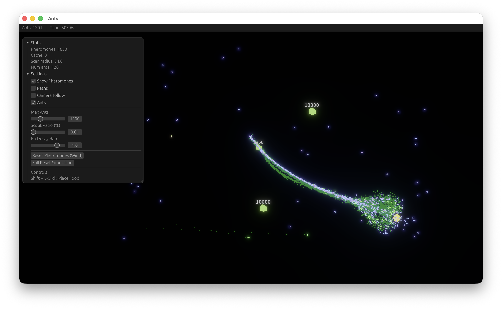

# Ant Colony Simulation

A high-performance, interactive ant colony simulation built with **Rust** and the **Bevy** game engine. This project simulates complex emergent behaviors of ants including foraging, dynamic trail formation, and colony growth.



## 🐜 Key Features

*   **Emergent Intelligence**: Ants use a "Retrace Steps" algorithm. They remember their exploration path and follow it back in reverse after finding food, creating optimized pheromone trails.
*   **Dynamic Population**: Start with a small scout group (10 ants). The colony only grows when food is successfully returned to the nest.
*   **Interactive Environment**:
    *   **God Mode**: Manually place food sources anywhere in the world.
    *   **Dynamic Food**: Food sources have limited units and visually shrink as they are consumed.
    *   **Wind Effect**: Instantly clear pheromone trails to see how the colony adapts to information loss.
*   **Performance**: Optimized with k-d trees for spatial pheromone lookups and individualized update timers to ensure smooth, non-synchronized movement of thousands of entities.

## 🎮 Controls

| Action | Control |
| :--- | :--- |
| **Toggle Menu** | `Tab` |
| **Place Food** | `Shift + Left Click` |
| **Pan Camera** | `Left Mouse Drag` |
| **Zoom In/Out** | `Mouse Wheel` |
| **Toggle Pheromones** | `F` (via Menu) |
| **Toggle Paths** | `P` (via Menu) |
| **Close App** | `Esc` |

## 🛠 Simulation Settings (Tab Menu)

*   **Max Ants**: Set the population ceiling for your colony.
*   **Scout Ratio (%)**: Adjust how many ants ignore pheromones to explore new territories (Logarithmic scale for precision).
*   **Ph Decay Rate**: Control how fast pheromone trails evaporate.
*   **Reset Pheromones (Wind)**: Wipe all existing trails.
*   **Full Reset Simulation**: Clear everything and start over with 10 ants.

## 🚀 Getting Started

### Prerequisites
*   [Rust](https://www.rust-lang.org/tools/install) (latest stable version)

### Running the Simulation
It is **highly recommended** to run in release mode for maximum performance:

```bash
cargo run --release
```

## 🏗 Technical Stack
*   **Engine**: Bevy 0.11 (ECS Architecture)
*   **UI**: `bevy_egui`
*   **Spatial Indexing**: `kd-tree` for efficient neighbor search.
*   **Camera**: `bevy_pancam` for interactive navigation.
